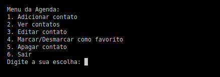

# Contact Manager

A simple console-based application to manage your contacts. This program allows you to easily add, view, edit, favorite and delete contacts.

## 🖥️ Contact Manager

## 🚀 How to Use

1. Run the program in your console environment.
2. Navigate through the menu using the provided options.
3. Follow the prompts to perform actions such as adding, viewing, editing, marking as favorite, and deleting contacts.
4. When you've finished your interactions, choose the option to exit the program.

## 👨🏻‍💻 Technologies Used

- **Python:** Core language for the console application.

